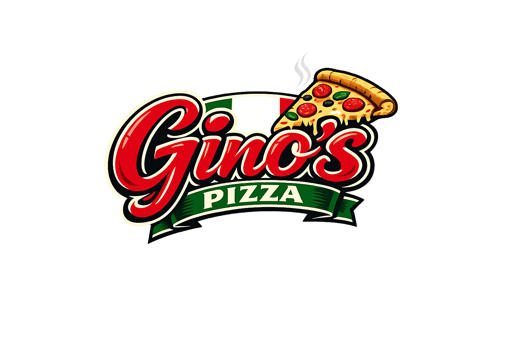

# Gino's Pizza - Voice-Driven Pizza Ordering Agent

<p align="center">
  
</p>

AI-powered pizza ordering agent built with the [SignalWire Agent SDK](https://github.com/signalwire/signalwire-agents). Customers order by voice while watching their pizza being assembled on-screen in real-time using layered transparent PNG assets.

## Features

- **Visual pizza builder** - Transparent PNG layers stack in real-time as the customer orders (crust, sauce, cheese, toppings, finishes)
- **Voice-driven state machine** - 14-step conversation flow with 30 SWAIG tools
- **Multi-pizza support** - Build multiple pizzas per order with tabbed canvas switching
- **Size-proportional display** - Small/medium/large pizzas render at 70%/85%/100% scale
- **Specialty presets** - Classic Pepperoni, Meat Lover's, Veggie Supreme, Hawaiian, Margherita
- **12 toppings** with light/normal/extra amounts and full/left/right half placement
- **Menu auto-follows** - On-screen menu tab highlights the current build step
- **Sides-only ordering** - Skip pizza entirely, just order breadsticks and drinks
- **131 automated tests** via `swaig-test` harness

## Quick Start

```bash
python -m venv .venv
source .venv/bin/activate
pip install -r requirements.txt
cp .env.example .env
# Edit .env with your SignalWire credentials
python app.py
```

Open browser to `http://localhost:5000`, click **Start Ordering**.

## File Structure

```
ginos/
  app.py                  # GinosPizzaAgent + AgentServer + all endpoints
  menu.py                 # Menu data, pricing, specialty presets
  pizza_builder.py        # Asset path resolution, price calculation
  test_flow.sh            # 131-test SWAIG harness
  requirements.txt
  Procfile
  app.json
  .env.example
  web/
    index.html            # Three-panel layout
    app.js                # WebRTC, event routing, order display
    pizza-renderer.js     # PizzaRenderer - CSS layer stacking engine
    style.css             # Italian pizzeria theme
    logo.png
    assets/               # 1024x1024 transparent PNGs (v2)
      crust/              # 4 types x 2 bakes = 8 files
      sauce/              # 4 types x 3 amounts = 12 files
      cheese/             # 3 types x 3 amounts + none = 10 files
      toppings/           # 12 toppings x 3 amounts x 3 placements = 108 files
      finish/             # 4 finishes = 4 files
```

## State Machine

14 steps, 30 tools. Every step transition goes through a tool call that emits a `user_event` to the frontend.

### Complete Flow Diagram

```
                            +-------------------------------+
                            |           GREETING            |
                            |                               |
                            |  start_pizza(size) ─────────────────────────> CHOOSE_CRUST
                            |  order_specialty(name,size) ────────────────> CONFIRMING_PIZZA
                            |  order_sides_only ──────────────────────────> ORDERING_SIDES
                            |  show_menu (stays)            |
                            +-------------------------------+
                                          ^                 ^
                     new_order            |                 |
                          |    cancel_order (from any step) |
                          |    add_another_pizza            |
                          |               |                 |
                          |               |                 |

  ╔═══════════════════════════════════════════════════════════════════════╗
  ║  PIZZA BUILD FLOW (one step per decision, one tool per step)          ║
  ║                                                                       ║
  ║  CHOOSE_CRUST ──select_crust──> CHOOSE_BAKE                           ║
  ║       |                              |                                ║
  ║       |                         select_bake                           ║
  ║       |                              |                                ║
  ║       |                              v                                ║
  ║       |                         CHOOSE_SAUCE                          ║
  ║       |                           /      \                            ║
  ║       |              select_sauce          select_sauce               ║
  ║       |             (sauce=none)            (has sauce)               ║
  ║       |                  |                      |                     ║
  ║       |                  |                      v                     ║
  ║       |                  |              CHOOSE_SAUCE_AMOUNT           ║
  ║       |                  |                      |                     ║
  ║       |                  |              select_sauce_amount           ║
  ║       |                  |                      |                     ║
  ║       |                  +-------+------+-------+                     ║
  ║       |                          |                                    ║
  ║       |                          v                                    ║
  ║       |                     CHOOSE_CHEESE                             ║
  ║       |                       /      \                                ║
  ║       |          select_cheese        select_cheese                   ║
  ║       |         (cheese=none)          (has cheese)                   ║
  ║       |                |                    |                         ║
  ║       |                |                    v                         ║
  ║       |                |            CHOOSE_CHEESE_AMOUNT              ║
  ║       |                |                    |                         ║
  ║       |                |            select_cheese_amount              ║
  ║       |                |                    |                         ║
  ║       |                +------+------+------+                         ║
  ║       |                       |                                       ║
  ║       |                       v                                       ║
  ║       |                  ADD_TOPPINGS  <──── modify_pizza             ║
  ║       |                  (loop: add_topping / remove_topping)         ║
  ║       |                       |                                       ║
  ║       |               done_with_toppings                              ║
  ║       |                       |                                       ║
  ║       |                       v                                       ║
  ║       |                  ADD_FINISHES                                 ║
  ║       |                  (loop: select_finish)                        ║
  ║       |                       |                                       ║
  ║       |                done_with_pizza                                ║
  ║       |                       |                                       ║
  ║       | cancel_pizza          v                                       ║
  ║       | cancel_order   +------+-------+                               ║
  ║       | (from any  --> |  CONFIRMING  |                               ║
  ║       |  build step)   |  PIZZA       | <── order_specialty (self)    ║
  ║       +--------------> |              |                               ║
  ║                        +-+--+--+--+---+                               ║
  ╚══════════════════════════|══|══|══|═══════════════════════════════════╝
                             |  |  |  |
              confirm_pizza  |  |  |  |  add_another_pizza
                             |  |  |  +──────────────────────> GREETING
                             |  |  |
                             |  |  +── change_pizza_size (stays in CONFIRMING_PIZZA)
                             |  |
                             |  +───── modify_pizza ────────> ADD_TOPPINGS
                             |
                             v
                      +---------------+
                      | ORDERING      |
                      | SIDES         | <── order_sides_only (from GREETING)
                      |               |
                      | add_side      (stays)
                      | remove_side   (stays)
                      | add_drink     (stays)
                      | remove_drink  (stays)
                      | review_order  (stays)
                      | show_menu     (stays)
                      |               |
                      | add_another_pizza ──────────────────> GREETING
                      | order_specialty ───────────────────> CONFIRMING_PIZZA
                      | cancel_order ──────────────────────> GREETING
                      |               |
                      +-------+-------+
                              |
                       finalize_order
                              |
                              v
                      +---------------+
                      |   PAYMENT     |
                      |               |
                      | cancel_order ──────────────────────> GREETING
                      +-------+-------+
                              |
                       process_payment
                              |
                              v
                      +---------------+
                      | ORDER_COMPLETE|
                      |   _PENDING    |
                      +-------+-------+
                              |
                       complete_order
                              |
                              v
                      +---------------+
                      | ORDER         |
                      | COMPLETE      |
                      +-------+-------+
                              |
                         new_order
                              |
                              v
                          GREETING
```

### Happy Path (Linear)

```
GREETING ─> CHOOSE_CRUST ─> CHOOSE_BAKE ─> CHOOSE_SAUCE ─> CHOOSE_SAUCE_AMOUNT
    ─> CHOOSE_CHEESE ─> CHOOSE_CHEESE_AMOUNT ─> ADD_TOPPINGS ─> ADD_FINISHES
    ─> CONFIRMING_PIZZA ─> ORDERING_SIDES ─> PAYMENT
    ─> ORDER_COMPLETE_PENDING ─> ORDER_COMPLETE ─> GREETING
```

### Skip Paths

```
  sauce=none:  CHOOSE_SAUCE ──────────> CHOOSE_CHEESE (skips CHOOSE_SAUCE_AMOUNT)
  cheese=none: CHOOSE_CHEESE ─────────> ADD_TOPPINGS  (skips CHOOSE_CHEESE_AMOUNT)
  no toppings: ADD_TOPPINGS ──────────> ADD_FINISHES   (via done_with_toppings)
  no finishes: ADD_FINISHES ──────────> CONFIRMING_PIZZA (via done_with_pizza)
  sides only:  GREETING ──────────────> ORDERING_SIDES (skips entire pizza flow)
  specialty:   GREETING ──────────────> CONFIRMING_PIZZA (skips entire build flow)
```

### Escape Routes (available at every build step)

```
  cancel_pizza ─> CONFIRMING_PIZZA (if completed pizzas exist) or GREETING (if empty)
  cancel_order ─> GREETING (clears everything, resets order)
```

### Loops

```
  ADD_TOPPINGS:     add_topping / remove_topping (repeat until done_with_toppings)
  ADD_FINISHES:     select_finish (repeat until done_with_pizza)
  ORDERING_SIDES:   add_side / remove_side / add_drink / remove_drink (repeat until finalize_order)
  CONFIRMING_PIZZA: order_specialty loops back to self (add multiple specialties)
```

### Step-by-Step Reference

| Step | Tools | Transitions To |
|------|-------|---------------|
| **greeting** | `start_pizza`, `order_specialty`, `order_sides_only`, `show_menu` | choose_crust, confirming_pizza, ordering_sides |
| **choose_crust** | `select_crust`, `cancel_pizza`, `cancel_order`, `show_menu` | choose_bake |
| **choose_bake** | `select_bake`, `cancel_pizza`, `cancel_order` | choose_sauce |
| **choose_sauce** | `select_sauce`, `cancel_pizza`, `cancel_order` | choose_sauce_amount or choose_cheese (none) |
| **choose_sauce_amount** | `select_sauce_amount`, `cancel_pizza`, `cancel_order` | choose_cheese |
| **choose_cheese** | `select_cheese`, `cancel_pizza`, `cancel_order` | choose_cheese_amount or add_toppings (none) |
| **choose_cheese_amount** | `select_cheese_amount`, `cancel_pizza`, `cancel_order` | add_toppings |
| **add_toppings** | `add_topping`, `remove_topping`, `done_with_toppings`, `cancel_pizza`, `cancel_order`, `show_menu` | add_finishes |
| **add_finishes** | `select_finish`, `done_with_pizza`, `cancel_pizza`, `cancel_order`, `show_menu` | confirming_pizza |
| **confirming_pizza** | `confirm_pizza`, `change_pizza_size`, `modify_pizza`, `add_another_pizza`, `order_specialty`, `cancel_pizza`, `cancel_order`, `show_menu` | ordering_sides, add_toppings, greeting, (self) |
| **ordering_sides** | `add_side`, `remove_side`, `add_drink`, `remove_drink`, `review_order`, `finalize_order`, `add_another_pizza`, `order_specialty`, `cancel_order`, `show_menu` | payment, choose_crust, confirming_pizza, greeting |
| **payment** | `process_payment`, `cancel_order` | order_complete_pending, greeting |
| **order_complete_pending** | `complete_order` | order_complete |
| **order_complete** | `new_order` | greeting |

## Menu & Pricing

| Category | Items | Price |
|----------|-------|-------|
| **Sizes** | Small 10", Medium 12", Large 14" | $8.99 / $11.99 / $14.99 |
| **Crusts** | Thin, Hand Tossed, Deep Dish, Stuffed | free / free / +$2.00 / +$3.00 |
| **Sauces** | Classic Red, Spicy Red, White Alfredo, BBQ, None | free / free / +$0.50 / +$0.50 |
| **Cheese** | Mozzarella, Cheddar Blend, Vegan, None | free / +$0.50 / +$1.50 |
| **Toppings** | Pepperoni, Mushrooms, Sausage, Green Peppers, Onions, Black Olives, Bacon, Pineapple, Jalapenos, Tomato, Basil, Ham | $1.00-$2.00 (half = half price) |
| **Finishes** | Parmesan, Red Pepper Flakes, Oregano, Garlic Butter | free / free / free / +$0.50 |
| **Specialties** | Classic Pepperoni, Meat Lover's, Veggie Supreme, Hawaiian, Margherita | base price minus $1-$2 discount |
| **Sides** | Breadsticks, Garlic Knots, Buffalo Wings, BBQ Wings, Garden Salad, Caesar Salad | $4.99-$9.99 |
| **Drinks** | Small Soda, Large Soda, Bottled Water, Iced Tea | $1.99-$2.99 |

Tax rate: 10%

## Event System

Every tool call emits a `user_event` to the WebRTC frontend via `swml_user_event()`. Events include order totals (subtotal, tax, total) — the frontend is display-only, no calculations.

| Event | Tool | Frontend Action |
|-------|------|----------------|
| `pizza_started` | `start_pizza` | Create canvas + tab, set size scale |
| `layer_added` | `select_bake`, `select_sauce_amount`, `select_cheese_amount`, `add_topping`, `select_finish` | Render PNG layer with fade-in |
| `layer_removed` | `remove_topping` | Fade-out and remove layer |
| `pizza_completed` | `done_with_pizza` | Render any missing layers, lock canvas, update order |
| `specialty_pizza` | `order_specialty` | Create canvas, stagger-render all layers, lock |
| `pizza_cancelled` | `cancel_pizza` | Remove canvas + tab |
| `pizza_confirmed` | `confirm_pizza` | Switch menu to sides |
| `pizza_modify` | `modify_pizza` | Unlock canvas, switch to it |
| `pizza_size_changed` | `change_pizza_size` | Rescale canvas, update order |
| `toppings_done` | `done_with_toppings` | Switch menu to finishes |
| `adding_pizza` | `add_another_pizza` | Switch menu to specialties |
| `sides_only` | `order_sides_only` | Switch menu to sides |
| `side_added` / `side_removed` | `add_side` / `remove_side` | Update order, switch menu to drinks |
| `drink_added` / `drink_removed` | `add_drink` / `remove_drink` | Update order |
| `order_reviewed` | `review_order` | Full order sync |
| `order_finalized` | `finalize_order` | Lock order display |
| `payment_started` | `process_payment` | Show order number |
| `order_completed` | `complete_order` | Clear display, show completion |
| `order_cancelled` / `new_order` | `cancel_order` / `new_order` | Reset everything |
| `show_menu` | `show_menu` | Log only |

## Visual Pizza Rendering

Each pizza gets a `PizzaRenderer` instance managing absolutely-positioned `` elements inside a circular container:

- **Container**: Square div with `border-radius: 50%`, scaled by pizza size (70%/85%/100%)
- **Layers**: Each ingredient is `position: absolute; width: 100%; height: 100%`
- **Z-index**: crust(10) → sauce(20) → cheese(30) → toppings(40+) → finish(90+)
- **Animations**: Layers fade-in with CSS transitions on add, fade-out on remove
- **Half toppings**: Separate `left_half`/`right_half` asset variants
- **Multi-pizza**: Tab bar above canvas, each tab holds a separate renderer

## API Endpoints

| Route | Method | Purpose |
|-------|--------|---------|
| `/swml` | POST | SignalWire SWML/SWAIG |
| `/get_token` | GET | WebRTC guest token |
| `/api/menu` | GET | Full menu JSON |
| `/health` | GET | Health check |
| `/ready` | GET | Readiness check |
| `/assets/*` | GET | Pizza PNG assets |
| `/*` | GET | Web frontend |

## Testing

```bash
source .venv/bin/activate
./test_flow.sh           # 131 tests
./test_flow.sh --debug   # Verbose output with raw swaig-test commands
```

## Deployment

```bash
# Heroku / Dokku
git push dokku main

# Direct
gunicorn app:app --bind 0.0.0.0:5000 --workers 1 --worker-class uvicorn.workers.UvicornWorker
```

Required environment variables — see `.env.example`.
